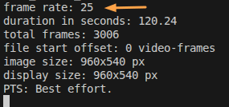

# XJadeo Video Sync

## Setup

1. Only once, install XJadeo on your machine
   - Windows: Download and install XJadeo, e.g. from [here](https://xjadeo.sourceforge.net/download.html)
   - Linux: run `sudo apt install xjadeo`
1. Before every session, launch XJadeo via the provided script
   - Windows: use the `launch XJadeo.bat` script
   - Linux: run `bash launch-xjadeo.sh`
1. Select a video file for playback for a Bitwig Studio project. In Bitwig Studio...
   1. Open a project.
   1. In the *Studio I/O panel*, unfold the *XJadeo Video Sync* settings.
   1. Enter the absolute video file path under *Path*.
   1. Enter the original frame rate of the video under *Frame Rate*.

Hint: XJadeo logs the original frame rate into the console:

## Features & Settings

- If you save the project and open it later, the video will be opened again together with the project.
- You can easily switch Bitwig project tabs with different videos and the XJadeo window will be updated on the fly!
- The *Flush!* buttons in the preferences and project-specific settings will (re-)send all data to the XJadeo window. This is helpful if XJadeo was opened after Bitwig Studio.

### Project-specific settings

  - Set a timing offset using the *Offset (h/min/s)* settings, if so desired
  - For looped video playback, activate the *Loop* checkbox

### Preferences

  - The *Keep on top* checkbox which will ensure that the video window stays in front of Bitwig Studio. (default: on)
  - The *Time display* setting allows you to activate a *Timecode* or *Frame number* text overlay on top of the video.

## How to import the original audio into Bitwig Studio

If Bitwig supports importing the video file format, you can drag the video into the project to play the original audio in sync with the video:
- Place the clip into the Arranger at position 1.1.1.00
- Make sure that time-stretching is off for that audio clip (*Mode* set to *Raw*)

## What's new?

If you want to see the recent feature additions and changes, please have a look into the [changelog](changelog.html).

For newer versions of this script, please look for updates at the [github repository](https://github.com/Trinitou/xjadeo_video_sync_for_bitwig/releases/latest).

Still could not fulfill you feature wish or something is not working? Be invited to create an issue [here](https://github.com/Trinitou/xjadeo_video_sync_for_bitwig/issues)!
